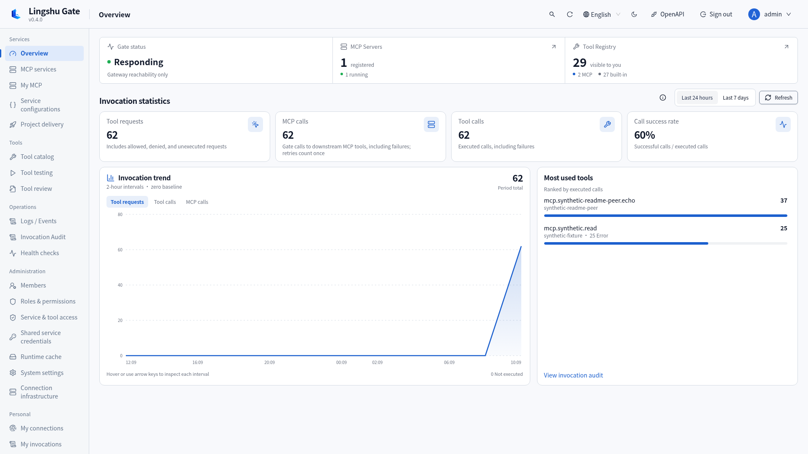
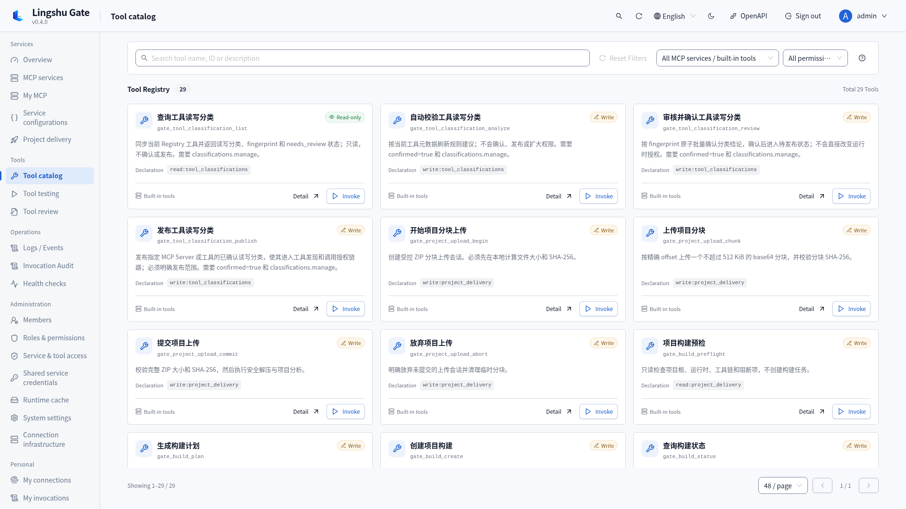
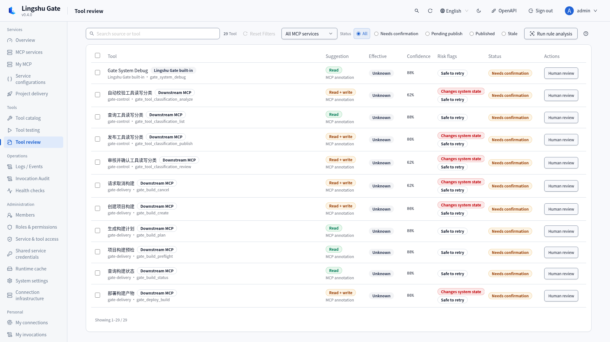
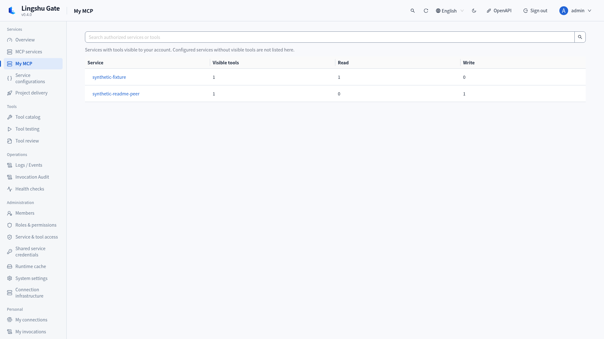
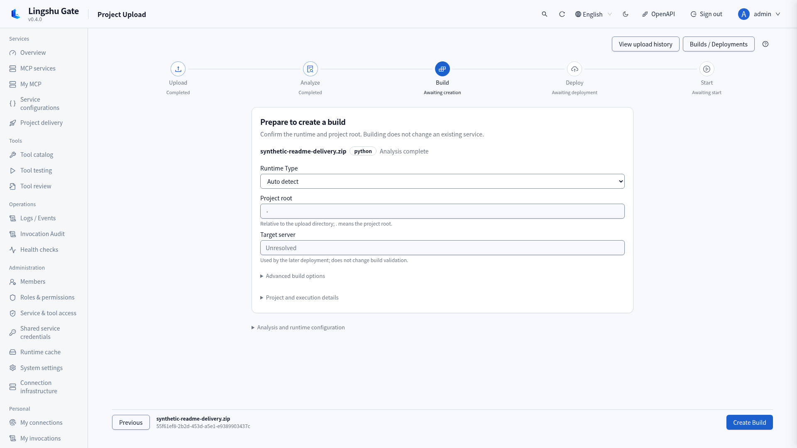
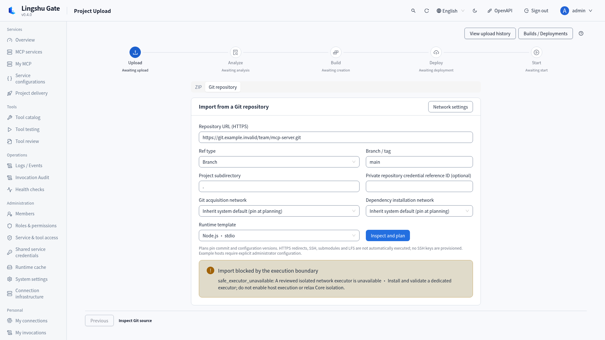
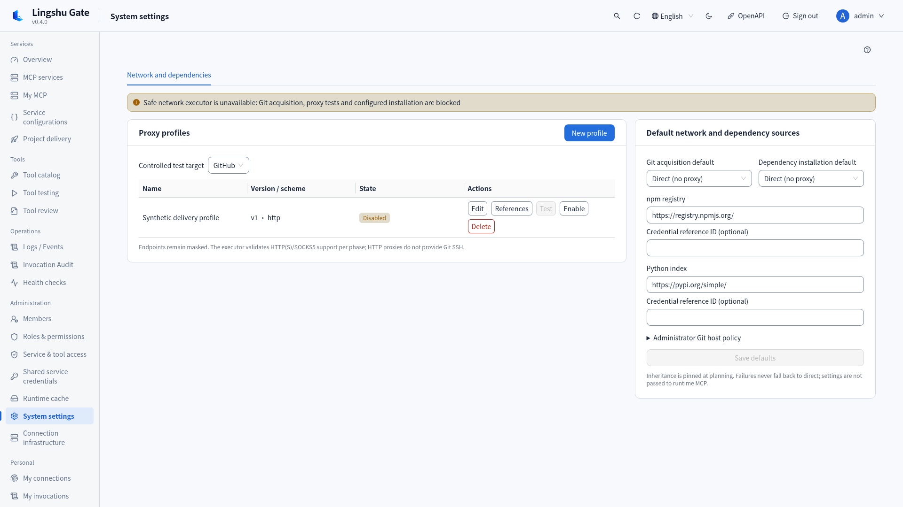
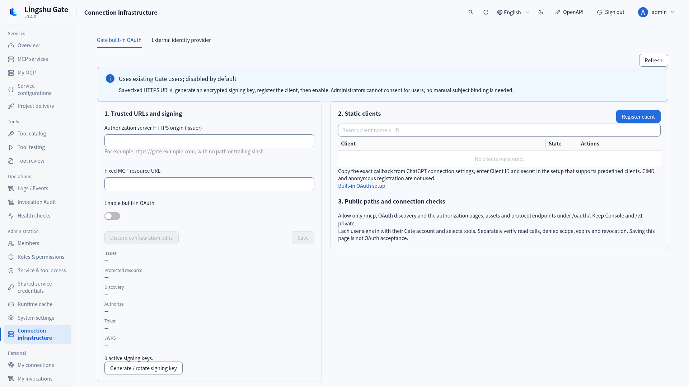
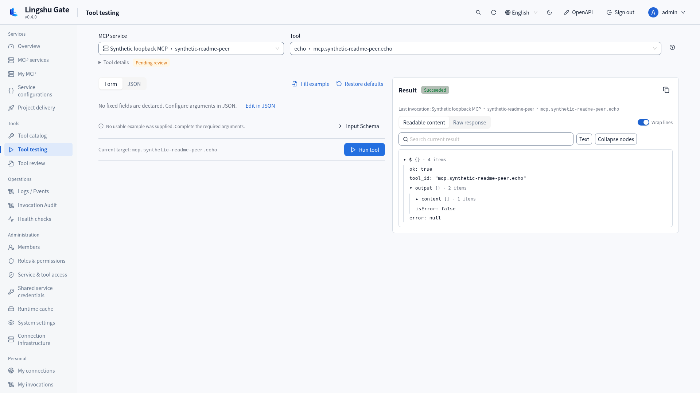

# Lingshu Gate

A self-hosted MCP gateway and control plane with explicit identity, tool-access, credential, audit and project-delivery boundaries.

[简体中文](README.zh-CN.md) · [Documentation](docs/README.md) · [Security](SECURITY.md) · [Contributing](CONTRIBUTING.md)

Use Gate to manage multiple MCP servers, give remote MCP clients controlled tool access, and deliver projects on trusted native hosts. One MCP Gateway, Web Console and control API connect service operations with user governance.

**0.4.4 release status: built-in OAuth and its separate management resource require explicit enablement. This unreleased development branch now implements an optional Native/Linux rootless Podman executor for Git/proxy/tool preparation and bounded npm, pnpm 8/9 and Yarn Classic offline installs/builds. It defaults to disabled and requires actual reviewed host readiness; real host acceptance is untested. Core remains gateway-only.**

0.4.4 adds a confirmed plan/apply/status/cancel workflow for external HTTP MCP configuration through REST and four built-in tools. The Delivery Skill documents separate paths for existing HTTP services, ZIP delivery and blocked Git execution. Offline planning contacts no peer; explicit connection and discovery keep credential, network-trust and classification boundaries. See the [release summary](packaging/release-notes.md). Generic management entries reject Console cookies; dedicated REST keeps CSRF. Credential rotation invalidates plans before connection/probe decryption, memory diagnostics omit process arguments/environment, and Core includes Debian’s Perl security fix.

The separate, default-off `/mcp/manage` OAuth resource requires a current administrator, explicit scopes, consented configuration tools and exact create/update targets. Console-confirmed target edits preserve token scope ceilings and invalidate old plans. Real-client management-scope requests and real-peer acceptance remain unverified. Group routing and a large-catalog search system are outside this release. See the [management contract](docs/oauth-external-management-design.md) and [external configuration workflow](docs/external-mcp-configuration.md). Sign-in and Console continue to show the running backend version from `/healthz`.

## Features

Development source adds [on-demand tool discovery](docs/on-demand-tools.md): explicitly select `/mcp?tool_mode=on_demand` per client to expose six bounded entries instead of the entire schema catalog. My API Tokens includes client settings; authorization and target audits keep their original boundaries. This addition has not been published as a new release; explicit group instance sessions reuse the existing routing port.

[Integration validation](docs/on-demand-integration-validation.md) records the exact test checkpoints, synthetic 50,000-tool measurements, Linux native worker evidence and untested boundaries.

| Feature | Capability and boundary | Guide |
|---|---|---|
| MCP gateway and transports | One authenticated Model Context Protocol endpoint; stateless JSON `/mcp`, remote MCP over Streamable HTTP, native stdio, explicit versions and bounded legacy negotiation. Tool aggregation, not generic resource/prompt hosting. | [Guide](docs/mcp-gateway.md) |
| Accounts and RBAC | Local sign-in, registration review, custom roles and permission types, service/tool grants, expiry, scoped personal API tokens and user status controls. | [Guide](docs/configuration.md) |
| Tool governance | Discovery → rule analysis → human review → publication; read/write and destructive/idempotent classifications, fingerprint checks, batch review and stale-definition reconciliation. Discovery never grants access. | [Guide](docs/mcp-gateway.md) |
| Built-in OAuth and remote access | Opt-in authorization-code flow for OAuth 2.1 / PKCE clients: confidential static clients, S256, per-user tool consent, encrypted RS256 signing keys, refresh rotation and revocation. Independent public consent UI; no DCR/CIMD or full-conformance claim. | [Guide](docs/builtin-oauth.md) |
| External identity providers | Optional external RS256 JWT verification, exact issuer/JWKS/audience/resource/client bindings, subject links and owner-bound delegations. Direct HTTPS or operator-managed tunnel configuration; Gate does not create tunnels. | [Guide](docs/external-connections.md) |
| Service configuration and lifecycle | Manifest Form/JSON editing, static validation, apply/reload, start/stop/connect, sectioned details, health, logs and restart history. Native managed containers require an explicitly approved digest-pinned image. | [Guide](docs/configuration.md) |
| Tool catalog and debugging | Service-scoped catalog and effective access badges; schema-driven Form/JSON arguments, defaults/examples, persistent result review and local result-content search. Invocation still rechecks permissions. | [Guide](docs/operations.md) |
| Encrypted credentials | Shared credential references and private per-user HTTP downstream bindings, masked metadata and one-time token/secret display. Shared stdio processes do not receive per-user credentials. | [Guide](docs/configuration.md) |
| Trusted project delivery | ZIP analysis and resumable MCP uploads, preflight, digest-bound BuildPlan, bounded build logs/cancellation, deployment preview and overwrite protection, startup and tool reconciliation. Native execution trusts project code; it is not an untrusted-code sandbox. | [Guide](docs/project-delivery.md) |
| Private drafts and recovery | Encrypted revisioned delivery drafts, independent upload/build/deploy/start confirmations, idempotent MCP writes and protected manual rollback. Replacement can interrupt a service; sessions do not migrate seamlessly. | [Guide](docs/console-delivery.md) |
| Git, proxies and dependency sources — partial | HTTPS commit-pinned plans, source bounds, named encrypted proxy revisions, separate Git/install defaults, inherit/direct/profile overrides and independent npm/Python sources. npm/pnpm/Yarn Classic plan checks are implemented. Optional Native/Linux acquisition/probes/fixed tool preparation and registry-only npm, pnpm 8/9 and Yarn Classic offline installs/builds are implemented on this development branch; real host acceptance is untested. Other manager cache installs are explicitly blocked. | [Guide](docs/git-import-network.md) |
| Personal workspace and file references | My MCP, connections, grants, invocations, API tokens and downstream credentials; short-lived user/target-bound `fileRef` uploads only for tools that explicitly accept them. | [Guide](docs/mcp-gateway.md) |
| Audit and observability | Tool audit decisions, invocation statistics, authorized service/tool log scopes, events, diagnostics, memory/environment summaries, runtime cache and liveness/startup/readiness probes. | [Guide](docs/operations.md) |
| Content recording and retention | Opt-in redacted bounded invocation input/output recording; separate log/event/invocation policies, cleanup preview and tracked jobs. Seven days is a default policy; the scheduled retention worker is off by default. | [Guide](docs/retention.md) |
| Console, API, automation and packages | English/Chinese, light/dark themes, desktop layouts, filtering/pagination, private REST/OpenAPI and CLI; confirmation-bound `gate_*` tools and Delivery Skill. Native packages, Docker Core, offline images, checksums, SBOM and backup/upgrade workflows. | [Guide](docs/releases.md) |

See the documentation index below for all workflows. [Invocation content recording](docs/invocation-recording.md) · [Git executor decision](docs/git-executor-decision.md)

## Console screenshots

Captured separately in each language from the 0.4.0 candidate code on an isolated local test instance with synthetic users, services and projects. No real external account, user proxy or production credential is present. Git blockage and disabled OAuth are shown as observed. Screenshots are UI evidence, not production integration acceptance. [Capture and validation record](docs/release-validation.md).



*Overview and invocation statistics · synthetic test instance*



*MCP tool catalog and effective access · synthetic test instance*

<details>
<summary>Review, personal workspace, delivery, Git, networking, OAuth and tool debugging</summary>



*Tool classification review and publication · synthetic test instance*



*Personal MCP workspace · synthetic test instance*



*Trusted ZIP delivery workspace · synthetic test instance*



*Git source form with the unavailable executor shown · synthetic test instance*



*System settings: network profiles and dependency sources · synthetic test instance*



*Built-in OAuth administration, disabled by default · synthetic test instance*



*Tool debugging and result review · synthetic test instance*

</details>

## Quick start

### Docker Compose

Docker Compose is the shortest path to an isolated Gate control plane and HTTP gateway:

```bash
mkdir -p runtime/workspace
docker compose up -d --build core
docker compose ps
```

Open <http://127.0.0.1:8000/console>. On an empty data volume, Gate creates a one-time administrator password in `/data/initial-admin-credentials.json`:

```bash
docker compose exec core sh -c 'cat /data/initial-admin-credentials.json'
```

Sign in, change the password immediately, and create narrowly scoped users or API tokens. The one-time credentials file is removed after the password is changed.

The default Compose service binds to `127.0.0.1`, runs as UID/GID `10001`, uses a read-only root filesystem, and keeps authentication enabled. The Core image connects to external Streamable HTTP servers; use a native installation when Gate must launch local stdio processes or execute project builds.

### Prebuilt native package

Download the archive for your platform and `SHA256SUMS` from [GitHub Releases](https://github.com/zhigege666/Lingshu-Gate/releases), verify the archive, extract it, then run:

```bash
./start.sh
```

On Windows:

```powershell
.\start.cmd
```

The launcher creates package-local `data`, `config`, and `workspace` directories. You can also run `lingshu-gate` (`lingshu-gate.exe` on Windows) directly when you provide the required paths through `LINGSHU_GATE_*` environment variables.

### From source

Requirements: Python 3.11, 3.12, or 3.13; Node.js 22.12 or later; npm; and `uv`.

```bash
uv sync --frozen
npm --prefix web ci
npm --prefix web run build
uv run lingshu-gate
```

Gate listens on `127.0.0.1:8000` by default. The Web Console is at `/console`, OpenAPI documentation at `/docs`, and readiness probe at `/readyz`.

The **Roles & Permission Types** Console page separates roles and resource permission types into tabs. Search and source/status/level filters keep the lists compact; row actions stay visible and a detail panel shows the full permission set. Copy creates a new custom item with a new code. System-item restrictions and assigned-role/referenced-type deletion checks remain enforced by the API.

## First server

Create a vendor-neutral manifest in the configured `mcp.d` directory or use the Console. An external Streamable HTTP server looks like this:

```yaml
id: example-http
name: Example HTTP server
enabled: true
launch:
  type: external
transport:
  type: streamable_http
  endpoint: https://service.example/mcp
  protocol_version: "2026-07-28"
auto_start: false
```

Set `protocol_version` to `auto` or a supported explicit version; omission starts with `2026-07-28`. HTTP and stdio support different compatibility ranges; see [protocol negotiation](docs/mcp-gateway.md).

Validate and save the manifest, inspect discovered tools, classify them as read or write, review the result, and publish only the classifications that should be callable. Access is the intersection of control permission, resource grant, published classification, and API-token scope.

For local stdio configuration, credential references, lifecycle behavior, and gateway requests, see [MCP gateway and downstream servers](docs/mcp-gateway.md).

## Project delivery and remote access

Upload, preflight, build, deploy, overwrite, start, cancel and abandon keep their own permissions and confirmations; MCP writes also bind idempotency keys and digests. The Console saves encrypted private drafts, previews deployment differences and supports explicitly requested manual rollback when a protected snapshot is available. See [Project delivery](docs/project-delivery.md), [Console delivery](docs/console-delivery.md) and the bundled [Delivery Skill](.agents/skills/lingshu-gate-upload-build-start/SKILL.md).

Remote access can use Gate API tokens, built-in OAuth or an external RS256 IdP; OAuth defaults to disabled. Built-in mode reuses Gate users with separate public sign-in and tool consent; external mode verifies provider-issued tokens. `direct` HTTPS and `secure_mcp_tunnel` are operator-managed network choices. A reverse proxy cannot cross NAT alone, and a machine tunnel key is not a user identity. See [Built-in OAuth](docs/builtin-oauth.md) and [external identity/network access](docs/external-connections.md). Keep Console and `/v1` private; expose only the selected mode's MCP, discovery and required `/oauth` paths.

## Security defaults

- Authentication is enabled, and initial credentials are random and local to the data directory.
- Network binding defaults to loopback; remote access belongs behind an HTTPS reverse proxy.
- Session cookies are `HttpOnly` and `SameSite=Lax`; enable `LINGSHU_GATE_AUTH_COOKIE_SECURE=true` behind HTTPS.
- MCP payload logging is disabled by default.
- Secrets are encrypted at rest and returned only as masked metadata; manifests should use `${credential:<id>}` references.
- Tool annotations are hints. Human-reviewed, published classifications and explicit grants determine effective access.
- The Docker Core service drops Linux capabilities, prevents privilege escalation, and mounts the workspace read-only.

Read [SECURITY.md](SECURITY.md) before exposing Gate outside a single trusted host.

## Release downloads

Release automation builds the following archives:

| Target | Archive |
|---|---|
| Linux x86-64 | `lingshu-gate-v<version>-linux-x86_64.tar.gz` |
| Linux ARM64 | `lingshu-gate-v<version>-linux-aarch64.tar.gz` |
| Windows x86-64 | `lingshu-gate-v<version>-windows-x86_64.zip` |
| macOS x86-64 | `lingshu-gate-v<version>-macos-x86_64.tar.gz` |
| macOS ARM64 | `lingshu-gate-v<version>-macos-arm64.tar.gz` |
| Docker Compose | `lingshu-gate-v<version>-docker-compose.tar.gz` |

Tagged releases also provide offline Linux Core images for `amd64` and `arm64` plus an application SPDX SBOM. Every native archive contains `SBOM.spdx.json`, `BUILD-INFO.json`, `LICENSE`, `NOTICE`, `THIRD_PARTY_NOTICES.md`, and this README. Verify the selected archive against `SHA256SUMS` before extraction; see [Release artifacts](docs/releases.md).

## Support matrix

| Capability | Linux native | Windows native | macOS native | Docker Core |
|---|:---:|:---:|:---:|:---:|
| Console, REST API, `/mcp` gateway | Yes | Yes | Yes | Yes |
| External Streamable HTTP downstream | Yes | Yes | Yes | Yes |
| Managed local stdio downstream | Yes | Yes | Yes | No |
| Explicit managed-container downstream | When a local engine is available | When a local engine is available | When a local engine is available | No |
| Local project build execution | With required host toolchain | With required host toolchain | With required host toolchain | No |
| SQLite persistence | Yes | Yes | Yes | Yes, single Core replica |
| Release architecture | x86-64, ARM64 | x86-64 | x86-64, ARM64 | Linux amd64, arm64 |

Native archives bundle Gate, not every project runtime. Downstream launch and build portability still depends on the project's own toolchain, commands, paths, and dependencies; preflight reports missing requirements before execution.

## Support boundaries

- Inbound `/mcp` is stateless JSON. It does not expose GET/SSE, separate legacy HTTP+SSE, general resources/prompts or unsolicited server messages. Downstream POST SSE responses do not expand inbound support.
- SQLite and quotas have a single-Core/single-process boundary, with no multi-tenancy or distributed quota guarantee. Core cannot execute local build/deploy/start and has no engine socket. Native trusted-project execution is not code isolation.
- Git SSH, automatic hooks/submodules/LFS and redirect credential forwarding are unsupported. Delivery proxies do not flow into runtime MCP or alter global Git/npm settings. Exact manager startup requires an administrator-reviewed Node/CLI registry; tools are not installed automatically.
- Automated checks use synthetic isolated environments. Real ChatGPT/OAuth, user Git/proxy and production upgrade acceptance remain separate. Platform packages and images are available only when the tagged release workflow actually publishes them.

## Documentation

- [MCP gateway, protocols, tool grants and file references](docs/mcp-gateway.md)
- [Accounts, configuration, credentials and runtime policy](docs/configuration.md)
- [Built-in OAuth administration and consent](docs/builtin-oauth.md)
- [External identity and remote network access](docs/external-connections.md)
- [Project delivery API/tools and Delivery Skill](docs/project-delivery.md)
- [Console delivery, private drafts and rollback](docs/console-delivery.md)
- [Git plans, network profiles and dependency sources](docs/git-import-network.md)
- [Git executor implementation and rollout decision](docs/git-executor-decision.md)
- [Service operations, debugging, audit and diagnostics](docs/operations.md)
- [Invocation input/output recording](docs/invocation-recording.md)
- [Retention policy and confirmed cleanup](docs/retention.md)
- [Deployment, backup, upgrades and recovery](docs/deployment.md)
- [Release packages, checksums and SBOM](docs/releases.md)
- [Architecture and security boundaries](docs/architecture.md)
- [Development, API and automated checks](docs/local-development.md)
- [Synthetic browser regression scenarios](docs/browser-regression.md)
- [Bounded performance measurement](docs/performance-review.md)
- [UI and accessibility acceptance contract](docs/ui-interaction-contract.md)
- [0.4.0 validation and screenshot provenance](docs/release-validation.md)

## License

Lingshu Gate is distributed under the Apache License 2.0. See [LICENSE](LICENSE) and [NOTICE](NOTICE). Third-party components remain subject to their respective licenses; packaged notices are recorded in [THIRD_PARTY_NOTICES.md](THIRD_PARTY_NOTICES.md).
