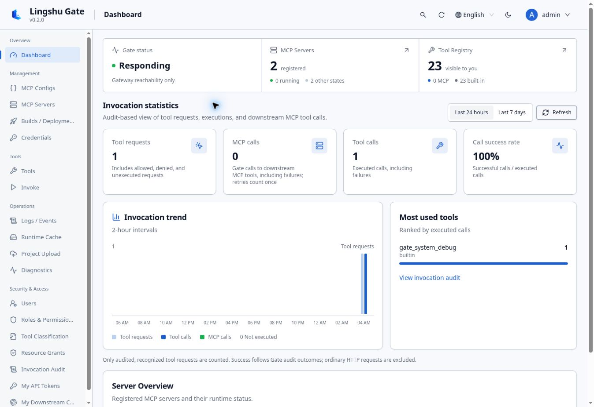
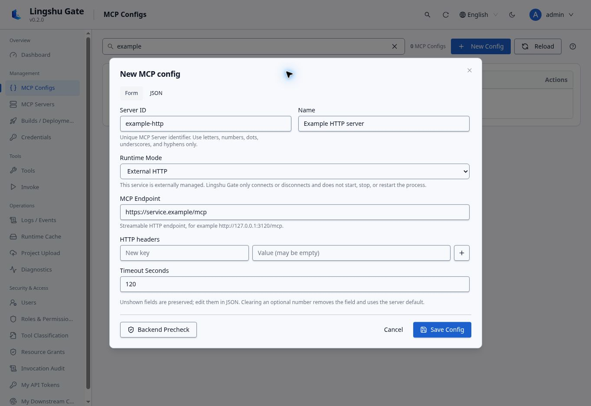
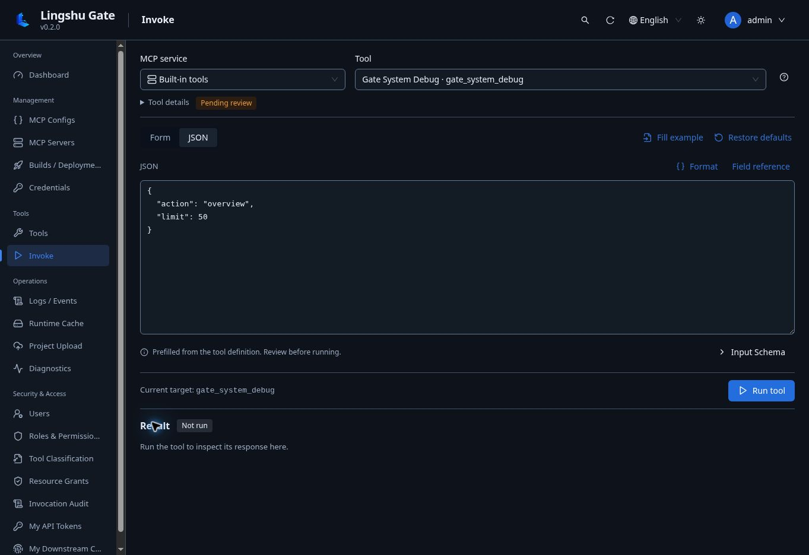

# Lingshu Gate

Self-hosted MCP gateway and control plane for operating downstream servers with explicit access, audit, and delivery boundaries.

[简体中文](README.zh-CN.md) · [Documentation](docs/README.md) · [Security](SECURITY.md) · [Contributing](CONTRIBUTING.md)

Lingshu Gate provides one authenticated MCP endpoint, a Web Console, configuration and runtime management, encrypted credentials, tool classification, invocation audit, diagnostics, and a controlled project upload/build/deploy/start workflow.

## What it provides

- One Streamable HTTP MCP gateway at `POST /mcp`.
- Generic downstream Streamable HTTP and stdio transports with automatic negotiation and explicit protocol versions; see the [MCP gateway guide](docs/mcp-gateway.md) for supported versions.
- Web Console and REST control API for server configuration and runtime state.
- Authentication, RBAC, resource grants, API-token scopes, tool classification, and invocation audit.
- Encrypted system credentials and isolated per-user downstream request bindings.
- Logs, events, health probes, diagnostics, and bounded runtime-cache management.
- Project upload, preflight, deterministic build planning, build, deploy, start, and tool-refresh operations.
- A repository-owned Delivery Skill at `.agents/skills/lingshu-gate-upload-build-start/` for confirmation-bound automation through the `gate_*` delivery tools.

## Console preview

English screenshots from a local Gate instance. The Console also supports Chinese.



*Dashboard — check gateway status, registered services, and invocation activity.*



*MCP configuration — maintain common settings in a form or switch to JSON.*



*Tool invocation — choose a tool, review its parameters, and inspect the result after running it.*

## Operations and validation

- English and Chinese Console; desktop acceptance targets are 1600×900, 1920×1080, 2560×1080, and 2560×1440.
- Large-list filtering and pagination, historical build-log windows, result-content search, and an integrated upload/configure/build/start journey.
- Separate [runtime-log, event, and invocation retention](docs/retention.md), each defaulting to 7 days; [input/output recording](docs/invocation-recording.md) is opt-in, redacted, size-bounded, and access-controlled.
- [Performance review and reproducible scripts](docs/performance-review.md) document workload sizes, measurement scope, and limits; the [browser regression guide](docs/browser-regression.md) covers roles and business scenarios. Unit tests, layout checks, and deployment acceptance are tracked separately; full Playwright and real ChatGPT OAuth integration acceptance remain outstanding.

The previously merged [empty-instance preview](docs/assets/console-dashboard.svg) remains available as a reference; screenshots do not establish complete acceptance of the current version.

## Quick start

### Docker Compose

Docker Compose is the shortest path to an isolated Gate control plane and HTTP gateway:

```bash
mkdir -p runtime/workspace
docker compose up -d --build core
docker compose ps
```

Open <http://127.0.0.1:8000/console>. On an empty data volume, Gate creates a one-time administrator password in `/data/initial-admin-credentials.json`:

```bash
docker compose exec core sh -c 'cat /data/initial-admin-credentials.json'
```

Sign in, change the password immediately, and create narrowly scoped users or API tokens. The one-time credentials file is removed after the password is changed.

The default Compose service binds to `127.0.0.1`, runs as UID/GID `10001`, uses a read-only root filesystem, and keeps authentication enabled. The Core image connects to external Streamable HTTP servers; use a native installation when Gate must launch local stdio processes or execute project builds.

### Prebuilt native package

Download the archive for your platform and `SHA256SUMS` from [GitHub Releases](https://github.com/zhigege666/Lingshu-Gate/releases), verify the archive, extract it, then run:

```bash
./start.sh
```

On Windows:

```powershell
.\start.cmd
```

The launcher creates package-local `data`, `config`, and `workspace` directories. You can also run `lingshu-gate` (`lingshu-gate.exe` on Windows) directly when you provide the required paths through `LINGSHU_GATE_*` environment variables.

### From source

Requirements: Python 3.11, 3.12, or 3.13; Node.js 22; npm; and `uv`.

```bash
uv sync --frozen
npm --prefix web ci
npm --prefix web run build
uv run lingshu-gate
```

Gate listens on `127.0.0.1:8000` by default. The Web Console is at `/console`, OpenAPI documentation at `/docs`, and readiness probe at `/readyz`.

The **Roles & Permission Types** Console page separates roles and resource permission types into tabs. Search and source/status/level filters keep the lists compact; row actions stay visible and a detail panel shows the full permission set. Copy creates a new custom item with a new code. System-item restrictions and assigned-role/referenced-type deletion checks remain enforced by the API.

## First server

Create a vendor-neutral manifest in the configured `mcp.d` directory or use the Console. An external Streamable HTTP server looks like this:

```yaml
id: example-http
name: Example HTTP server
enabled: true
launch:
  type: external
transport:
  type: streamable_http
  endpoint: https://service.example/mcp
  protocol_version: "2026-07-28"
auto_start: false
```

Set `protocol_version` to `auto` or a supported explicit version; omission starts with `2026-07-28`. HTTP and stdio support different compatibility ranges; see [protocol negotiation](docs/mcp-gateway.md).

Validate and save the manifest, inspect discovered tools, classify them as read or write, review the result, and publish only the classifications that should be callable. Access is the intersection of control permission, resource grant, published classification, and API-token scope.

For local stdio configuration, credential references, lifecycle behavior, and gateway requests, see [MCP gateway and downstream servers](docs/mcp-gateway.md).

## Project delivery

Gate exposes confirmation-bound `gate_*` tools for resumable upload, preflight, build planning, build execution, deployment, startup, and post-start tool reconciliation. Each write is idempotency-bound; source, plan, configuration, credential, and tool-snapshot digests prevent silent drift.

The bundled [Delivery Skill](.agents/skills/lingshu-gate-upload-build-start/SKILL.md) adds deterministic local packaging and an operator workflow around those tools. It never removes the requirement for explicit confirmation before upload, code execution, deployment, overwrite, startup, cancellation, or abandonment.

See [Project delivery](docs/project-delivery.md) for the complete boundary and tool list.

## Remote MCP access

External OAuth access defaults to disabled. Gate supports `secure_mcp_tunnel` and `direct` HTTPS, plus the `disabled` state. The [external access and network guide](docs/external-connections.md#choosing-the-network-path) covers a private tunnel, named tunnels, frp with a public TLS proxy, existing public reverse proxies and optional ngrok. Network daemons remain operator-managed; a reverse proxy alone cannot cross NAT.

Expose only MCP and required discovery paths, keep Console/management private, and validate separate per-user OAuth authorization. A machine tunnel key is not an end-user identity. Follow the guide's read-only, write and revocation acceptance sequence before deployment enablement. No external connection is enabled by following this README alone.

## Security defaults

- Authentication is enabled, and initial credentials are random and local to the data directory.
- Network binding defaults to loopback; remote access belongs behind an HTTPS reverse proxy.
- Session cookies are `HttpOnly` and `SameSite=Lax`; enable `LINGSHU_GATE_AUTH_COOKIE_SECURE=true` behind HTTPS.
- MCP payload logging is disabled by default.
- Secrets are encrypted at rest and returned only as masked metadata; manifests should use `${credential:<id>}` references.
- Tool annotations are hints. Human-reviewed, published classifications and explicit grants determine effective access.
- The Docker Core service drops Linux capabilities, prevents privilege escalation, and mounts the workspace read-only.

Read [SECURITY.md](SECURITY.md) before exposing Gate outside a single trusted host.

## Release downloads

Release automation builds the following archives:

| Target | Archive |
|---|---|
| Linux x86-64 | `lingshu-gate-v<version>-linux-x86_64.tar.gz` |
| Linux ARM64 | `lingshu-gate-v<version>-linux-aarch64.tar.gz` |
| Windows x86-64 | `lingshu-gate-v<version>-windows-x86_64.zip` |
| macOS x86-64 | `lingshu-gate-v<version>-macos-x86_64.tar.gz` |
| macOS ARM64 | `lingshu-gate-v<version>-macos-arm64.tar.gz` |
| Docker Compose | `lingshu-gate-v<version>-docker-compose.tar.gz` |

Tagged releases also provide offline Linux Core images for `amd64` and `arm64` plus an application SPDX SBOM. Every native archive contains `SBOM.spdx.json`, `BUILD-INFO.json`, `LICENSE`, `NOTICE`, `THIRD_PARTY_NOTICES.md`, and this README. Verify the selected archive against `SHA256SUMS` before extraction; see [Release artifacts](docs/releases.md).

## Support matrix

| Capability | Linux native | Windows native | macOS native | Docker Core |
|---|:---:|:---:|:---:|:---:|
| Console, REST API, `/mcp` gateway | Yes | Yes | Yes | Yes |
| External Streamable HTTP downstream | Yes | Yes | Yes | Yes |
| Managed local stdio downstream | Yes | Yes | Yes | No |
| Explicit managed-container downstream | When a local engine is available | When a local engine is available | When a local engine is available | No |
| Local project build execution | With required host toolchain | With required host toolchain | With required host toolchain | No |
| SQLite persistence | Yes | Yes | Yes | Yes, single Core replica |
| Release architecture | x86-64, ARM64 | x86-64 | x86-64, ARM64 | Linux amd64, arm64 |

Native archives bundle Gate, not every project runtime. Downstream launch and build portability still depends on the project's own toolchain, commands, paths, and dependencies; preflight reports missing requirements before execution.

## Documentation

- [Architecture](docs/architecture.md)
- [Configuration](docs/configuration.md)
- [MCP gateway and downstream servers](docs/mcp-gateway.md)
- [Project delivery](docs/project-delivery.md)
- [Git import and network settings](docs/git-import-network.md) — source/plan support and the unavailable safe-executor boundary
- [Deployment](docs/deployment.md)
- [Operations](docs/operations.md)
- [Local development](docs/local-development.md)
- [Release artifacts](docs/releases.md)

## License

Lingshu Gate is distributed under the Apache License 2.0. See [LICENSE](LICENSE) and [NOTICE](NOTICE). Third-party components remain subject to their respective licenses; packaged notices are recorded in [THIRD_PARTY_NOTICES.md](THIRD_PARTY_NOTICES.md).
