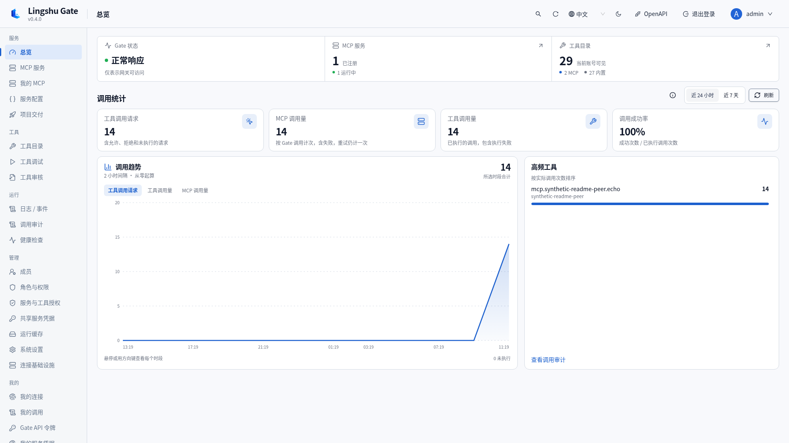
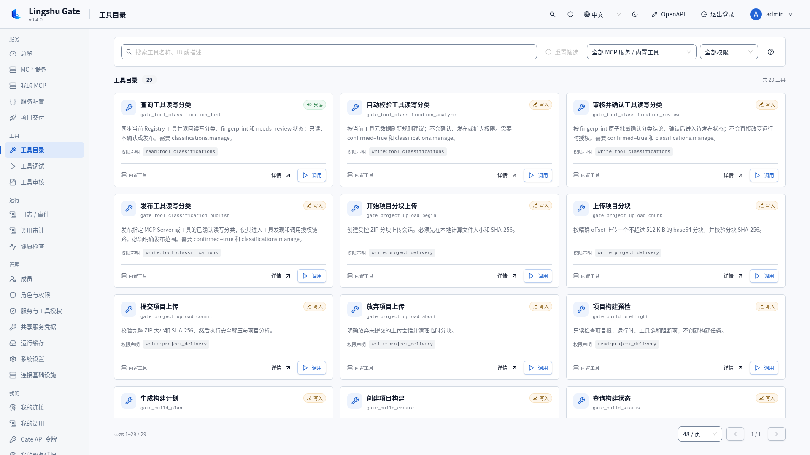
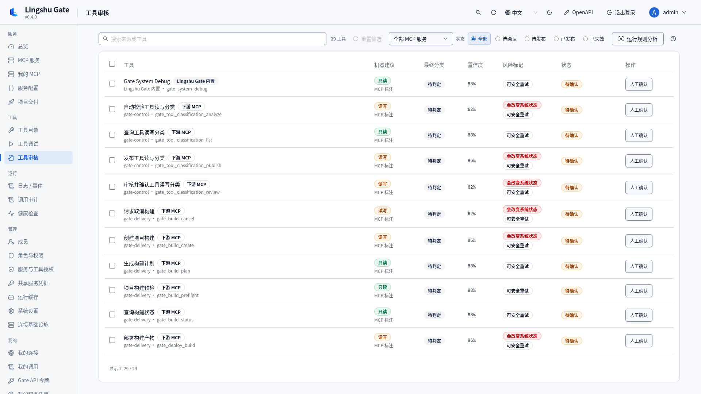
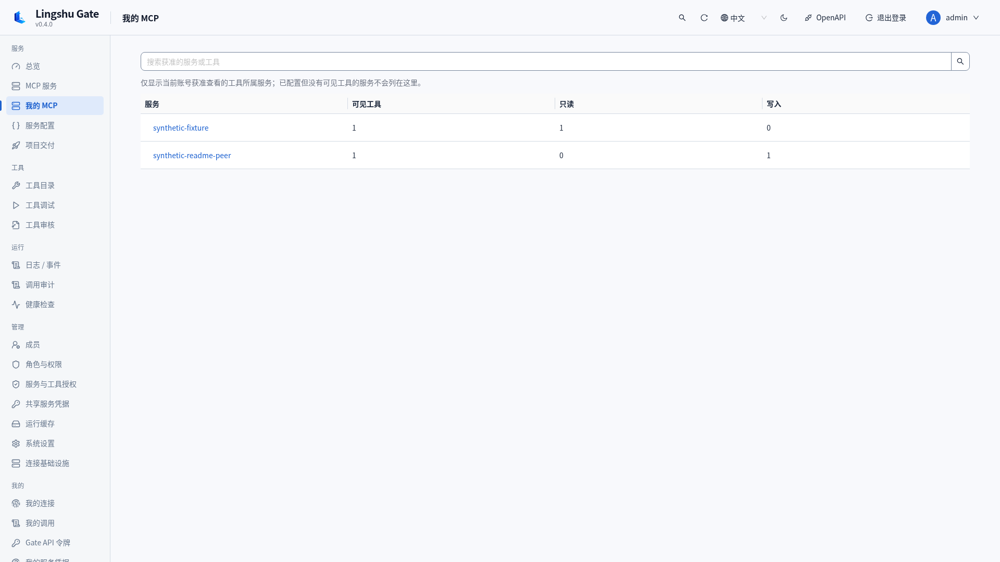
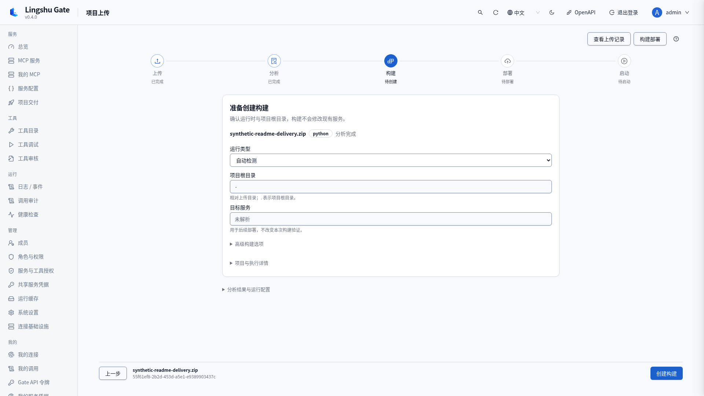
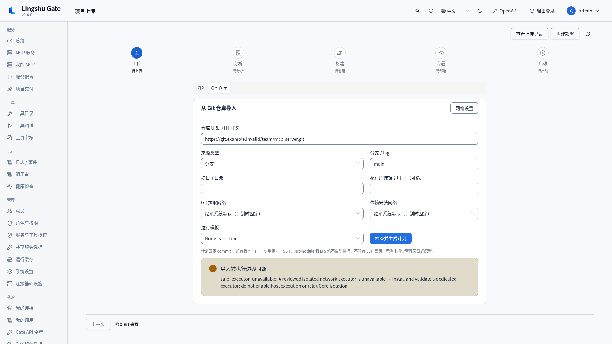
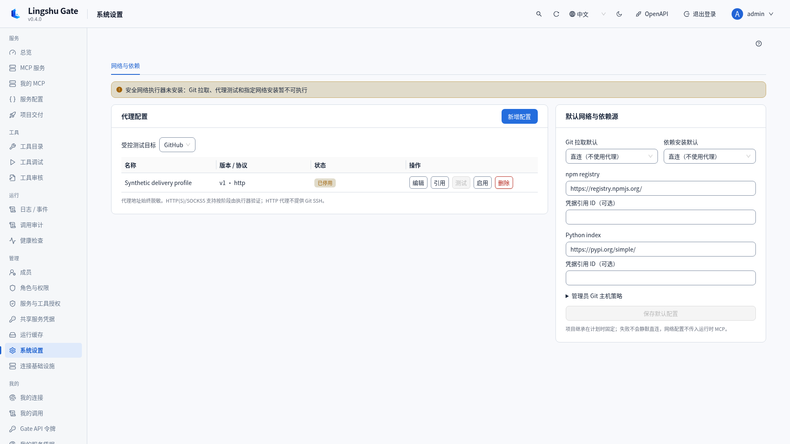
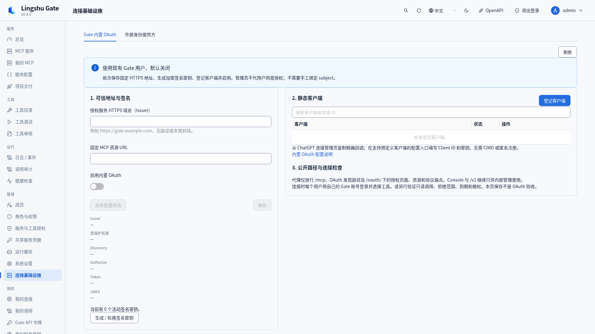
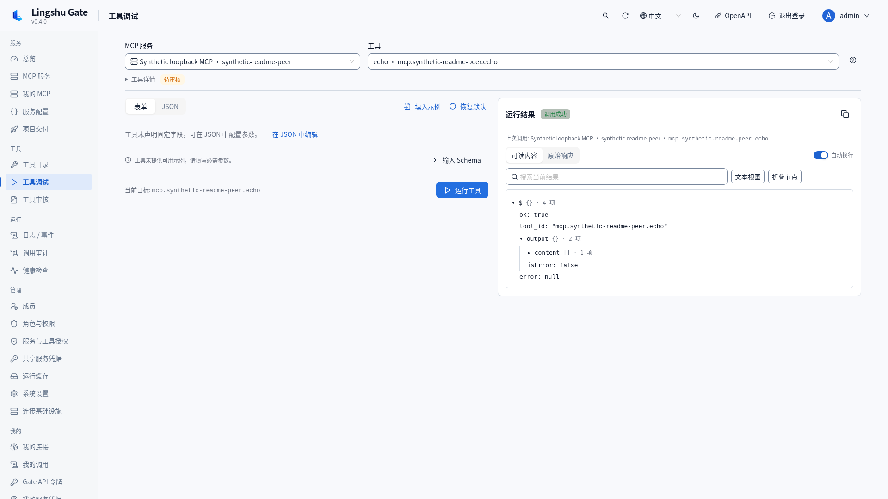

# Lingshu Gate

面向自托管 MCP 服务的聚合网关与控制面，让身份、工具权限、凭据、审计和项目交付保留明确边界。

[English](README.md) · [完整文档](docs/zh-CN/README.md) · [安全](SECURITY.zh-CN.md) · [参与开发](CONTRIBUTING.md)

适用于集中管理多个 MCP 服务、向远程 MCP 客户端提供受控工具访问，以及在可信原生主机上交付项目。通过一个 MCP Gateway、Web Console 和控制 API 管理服务与用户。

**0.4.4 发行状态：内置 OAuth 和独立管理资源须明确启用。本未发布开发分支已实现可选 Native/Linux rootless Podman 执行器，覆盖 Git/代理/固定工具准备及有界 npm、pnpm 8/9、Yarn Classic 离线安装/构建。默认关闭，须实际受审宿主 readiness，真实宿主验收未测。Core 仍仅为 gateway。**

0.4.4 通过 REST 和四个内置工具，增加外部 HTTP MCP 配置的确认计划、应用、状态和取消流程。自带 Delivery Skill 将现有 HTTP 服务、ZIP 交付和仍阻断的 Git 执行路径分别路由。离线计划不连接 peer；明确连接和工具发现保留凭据、网络信任与分类审核边界。见[发行摘要](packaging/release-notes.md)。 通用管理入口拒绝 Console cookie，专用 REST 保留 CSRF；凭据轮换在连接/探测解密前使计划失效，内存诊断不读取进程参数/环境，Core 纳入 Debian Perl 安全修复。

独立且默认关闭的 `/mcp/manage` OAuth 资源要求当前管理员、明确 scope、已同意配置工具及精确创建/更新目标。Console 确认修改目标保留令牌 scope 上限并使旧计划失效。真实客户端管理 scope 请求与真实 peer 验收仍未验证。分组路由与海量目录检索不纳入本版。参见[管理契约](docs/zh-CN/oauth-external-management-design.md)与[外部配置流程](docs/zh-CN/external-mcp-configuration.md)。登录页与 Console 继续从 `/healthz` 显示运行中的后端版本。

## 现有功能

| 功能 | 能力与边界 | 指南 |
|---|---|---|
| MCP 聚合网关与传输 | 统一认证的 Model Context Protocol 入口；无状态 JSON `/mcp`、Streamable HTTP 远程 MCP、原生 stdio、明确版本与有界旧协议协商。聚合工具，不提供通用 resource/prompt 托管。 | [指南](docs/zh-CN/mcp-gateway.md) |
| 用户与 RBAC | 本地登录、注册审核、自定义角色和权限类型、服务/工具授权与到期、限定范围的个人 API 令牌及用户状态管理。 | [指南](docs/zh-CN/configuration.md) |
| 工具权限治理 | 发现 → 规则分析 → 人工审核 → 发布；读写、破坏性与幂等分类、指纹检查、批量审核和过期定义对账。发现不授予权限。 | [指南](docs/zh-CN/mcp-gateway.md) |
| 内置 OAuth 与远程访问 | 明确启用的授权码流程，面向 OAuth 2.1 / PKCE 客户端：机密静态客户端、S256、每用户工具同意、加密 RS256 签名密钥、刷新轮换与撤销。独立公网同意页；不支持 DCR/CIMD，不宣称全面规范合规。 | [指南](docs/zh-CN/builtin-oauth.md) |
| 外部身份提供方 | 可选外部 RS256 JWT 校验，精确 issuer/JWKS/audience/resource/client 绑定、身份映射和仅本人可管理的委托。支持直连 HTTPS 或管理员维护的隧道配置；Gate 不创建隧道。 | [指南](docs/zh-CN/external-connections.md) |
| 服务配置与生命周期 | Manifest 表单/JSON 编辑、静态校验、应用/重载、启动/停止/连接、分区详情、健康、日志与重启历史。原生托管容器要求明确复核的 digest 固定镜像。 | [指南](docs/zh-CN/configuration.md) |
| 工具目录与调试 | 按服务筛选的工具目录与有效权限标识；Schema 驱动的表单/JSON 参数、默认值/示例、结果复核与本地结果内容搜索。执行时仍重新校验权限。 | [指南](docs/zh-CN/operations.md) |
| 加密凭据 | 共享凭据引用、私有的每用户 HTTP 下游绑定、脱敏元数据和仅一次展示的令牌/密钥。共享 stdio 进程不接收每用户凭据。 | [指南](docs/zh-CN/configuration.md) |
| 可信项目交付 | ZIP 分析与可续传 MCP 上传、预检、摘要绑定 BuildPlan、有界构建日志/取消、部署预览与覆盖保护、启动及工具对账。原生执行要求信任项目源码，并非不可信代码沙箱。 | [指南](docs/zh-CN/project-delivery.md) |
| 私有草稿与恢复 | 加密且带版本的交付草稿、独立的上传/构建/部署/启动确认、幂等 MCP 写操作及受保护的手动回滚。替换可中断服务，不做无缝会话迁移。 | [指南](docs/zh-CN/console-delivery.md) |
| Git、代理与依赖源 — 部分支持 | HTTPS 固定 commit、来源限额、加密代理不可变修订、独立 Git/install 与 inherit/direct/profile。本开发分支实现可选 Native/Linux 获取/代理测试/固定工具准备和 registry-only npm、pnpm 8/9、Yarn Classic 离线安装/构建；其他 manager cache 安装明确阻断，真实宿主验收未测。 | [指南](docs/zh-CN/git-import-network.md) |
| 个人工作区与文件引用 | 我的 MCP、连接、授权、调用、API 令牌和下游凭据；仅对明确支持的工具提供短期、用户/目标绑定的 `fileRef` 上传。 | [指南](docs/zh-CN/mcp-gateway.md) |
| 审计与可观测性 | 工具授权决策审计、调用统计、按权限限定的服务/工具日志范围、事件、诊断、内存/环境摘要、运行缓存及存活/启动/就绪探针。 | [指南](docs/zh-CN/operations.md) |
| 内容记录与保留策略 | 可选开启的脱敏、有界调用入出参记录；独立日志/事件/调用保留策略、清理预览和作业记录。7 天只是默认策略，定时 retention worker 默认关闭。 | [指南](docs/zh-CN/retention.md) |
| Console、API、自动化与发行包 | 中英文、明暗主题、桌面布局、筛选/分页、私有 REST/OpenAPI 和 CLI；带确认边界的 `gate_*` 工具与 Delivery Skill。原生包、Docker Core、离线镜像、校验和、SBOM 及备份/升级流程。 | [指南](docs/zh-CN/releases.md) |

完整操作入口见下方文档索引。[调用内容记录](docs/zh-CN/invocation-recording.md) · [Git 执行决策](docs/zh-CN/git-executor-decision.md)

## Console 截图

以下截图由 0.4.0 候选代码在隔离的本地测试实例中分别切换中英文拍摄，使用合成用户、服务和项目；没有真实外部账户、用户代理或生产凭据。Git 阻断和 OAuth 关闭状态如实展示。截图是界面证据，不是生产接入验收。[拍摄与验证记录](docs/zh-CN/release-validation.md)。



*总览与调用统计 · 合成测试实例*



*MCP 工具目录与有效权限 · 合成测试实例*

<details>
<summary>审核、个人工作区、交付、Git、网络、OAuth 与工具调试</summary>



*工具分类审核与发布 · 合成测试实例*



*个人 MCP 工作区 · 合成测试实例*



*可信 ZIP 项目交付工作区 · 合成测试实例*



*Git 来源表单与执行器未实现的阻断状态 · 合成测试实例*



*系统设置：网络配置与依赖源 · 合成测试实例*



*内置 OAuth 管理，默认关闭 · 合成测试实例*



*工具调试与结果复核 · 合成测试实例*

</details>

## 快速开始

### Docker Compose

Docker Compose 是启动隔离控制平面和 HTTP 网关的最短路径：

```bash
mkdir -p runtime/workspace
docker compose up -d --build core
docker compose ps
```

打开 <http://127.0.0.1:8000/console>。空数据卷首次启动时，Gate 会把一次性管理员密码写入 `/data/initial-admin-credentials.json`：

```bash
docker compose exec core sh -c 'cat /data/initial-admin-credentials.json'
```

登录后立即修改密码，再创建最小权限的用户或 API Token。密码修改成功后，一次性凭据文件会自动删除。

默认 Compose 服务只绑定 `127.0.0.1`，以 UID/GID `10001` 运行，根文件系统只读，并保持认证开启。Core 镜像用于连接外部 Streamable HTTP 服务；当 Gate 需要启动本机 stdio 进程或执行项目构建时，请使用原生安装。

### 预构建原生包

从 [GitHub Releases](https://github.com/zhigege666/Lingshu-Gate/releases) 下载对应平台的压缩包和 `SHA256SUMS`，完成校验并解压，然后运行：

```bash
./start.sh
```

Windows：

```powershell
.\start.cmd
```

启动器会创建包内的 `data`、`config` 和 `workspace` 目录。也可以直接运行 `lingshu-gate`（Windows 为 `lingshu-gate.exe`），此时应通过 `LINGSHU_GATE_*` 环境变量提供所需路径。

### 从源码运行

要求 Python 3.11、3.12 或 3.13、Node.js 22、npm 和 `uv`。

```bash
uv sync --frozen
npm --prefix web ci
npm --prefix web run build
uv run lingshu-gate
```

Gate 默认监听 `127.0.0.1:8000`。Web Console 位于 `/console`，OpenAPI 文档位于 `/docs`，就绪探针位于 `/readyz`。

Console 的 **角色与权限类型** 页面通过页签区分角色和资源权限类型，支持名称/代码搜索、来源/状态/基础级别筛选、平铺行内操作和完整权限详情。复制会创建需要新代码的自定义项；系统项限制、已有成员角色及被授权引用类型的删除校验仍由 API 执行。

## 第一个服务

在配置的 `mcp.d` 目录中创建通用 Manifest，或使用 Console：

```yaml
id: example-http
name: Example HTTP server
enabled: true
launch:
  type: external
transport:
  type: streamable_http
  endpoint: https://service.example/mcp
  protocol_version: "2026-07-28"
auto_start: false
```

`protocol_version` 可设为 `auto` 或受支持的显式版本；省略时优先尝试 `2026-07-28`。HTTP 与 stdio 的兼容版本范围不同，详见 [协议协商](docs/zh-CN/mcp-gateway.md)。

校验并保存 Manifest，检查发现的工具，将其分类为只读或写入，人工复核后只发布允许调用的分类。最终访问权限是控制权限、资源授权、已发布分类和 API Token scope 的交集。

本机 stdio 配置、凭据引用、生命周期行为和网关请求见 [MCP 网关与下游服务](docs/zh-CN/mcp-gateway.md)。

## 项目交付与远程访问

上传、预检、构建、部署、覆盖、启动、取消和放弃各自保留权限与确认；MCP 写操作还绑定幂等键和摘要。Console 可保存加密私有草稿，预览部署差异，并在受保护快照可用时明确执行手动回滚。参见[交付指南](docs/zh-CN/project-delivery.md)、[Console 交付](docs/zh-CN/console-delivery.md)和仓库自带 [Delivery Skill](.agents/skills/lingshu-gate-upload-build-start/SKILL.md)。

远程访问可使用 Gate API 令牌、内置 OAuth 或外部 RS256 IdP；OAuth 默认关闭。内置模式复用 Gate 用户，在单独的公网页面登录与同意工具范围；外部模式只验证 provider 签发的令牌。`direct` HTTPS 和 `secure_mcp_tunnel` 是管理员维护的网络选择，反向代理不能单独穿透 NAT，机器隧道密钥不能替代用户身份。参见[内置 OAuth](docs/zh-CN/builtin-oauth.md)与[外部身份/网络接入](docs/zh-CN/external-connections.md)。Console 和 `/v1` 保持私有，仅公开所选模式所需的 MCP、发现与 `/oauth` 路径。

## 安全默认值

- 认证默认开启；初始凭据随机生成且只保存在数据目录。
- 网络默认绑定回环地址；远程访问应放在 HTTPS 反向代理之后。
- 会话 Cookie 使用 `HttpOnly` 和 `SameSite=Lax`；HTTPS 部署应设置 `LINGSHU_GATE_AUTH_COOKIE_SECURE=true`。
- MCP payload 日志默认关闭。
- Secret 加密保存，响应中仅返回掩码元数据；Manifest 应使用 `${credential:<id>}` 引用。
- Tool annotation 只是提示。人工复核并发布的分类和显式授权共同决定有效访问权限。
- Docker Core 服务会丢弃 Linux capabilities、禁止权限提升，并以只读方式挂载 workspace。

在单台受信任主机之外暴露 Gate 前，请先阅读 [SECURITY.zh-CN.md](SECURITY.zh-CN.md)。

## 发行下载

发行自动化构建以下归档：

| 目标 | 归档 |
|---|---|
| Linux x86-64 | `lingshu-gate-v<version>-linux-x86_64.tar.gz` |
| Linux ARM64 | `lingshu-gate-v<version>-linux-aarch64.tar.gz` |
| Windows x86-64 | `lingshu-gate-v<version>-windows-x86_64.zip` |
| macOS x86-64 | `lingshu-gate-v<version>-macos-x86_64.tar.gz` |
| macOS ARM64 | `lingshu-gate-v<version>-macos-arm64.tar.gz` |
| Docker Compose | `lingshu-gate-v<version>-docker-compose.tar.gz` |

Tag 发行还提供 `amd64` 和 `arm64` 的 Linux Core 离线镜像，以及应用 SPDX SBOM。每个原生包都包含 `SBOM.spdx.json`、`BUILD-INFO.json`、`LICENSE`、`NOTICE`、`THIRD_PARTY_NOTICES.md` 和本 README。解压前应按 `SHA256SUMS` 校验所选归档，详见 [发行产物](docs/zh-CN/releases.md)。

## 支持矩阵

| 能力 | Linux 原生 | Windows 原生 | macOS 原生 | Docker Core |
|---|:---:|:---:|:---:|:---:|
| Console、REST API、`/mcp` 网关 | 是 | 是 | 是 | 是 |
| 外部 Streamable HTTP 下游 | 是 | 是 | 是 | 是 |
| 受管本机 stdio 下游 | 是 | 是 | 是 | 否 |
| 显式受管容器下游 | 本机容器引擎可用时 | 本机容器引擎可用时 | 本机容器引擎可用时 | 否 |
| 本机项目构建执行 | 需要对应宿主工具链 | 需要对应宿主工具链 | 需要对应宿主工具链 | 否 |
| SQLite 持久化 | 是 | 是 | 是 | 是，仅单个 Core 副本 |
| 发行架构 | x86-64、ARM64 | x86-64 | x86-64、ARM64 | Linux amd64、arm64 |

原生归档只捆绑 Gate，不会捆绑所有项目运行时。下游启动和构建能否跨平台运行，仍取决于项目自身的工具链、命令、路径和依赖；预检会在执行前报告缺失项。

## 支持边界

- 入站 `/mcp` 是无状态 JSON；不提供 GET/SSE、旧式独立 HTTP+SSE、通用 resources/prompts 或未经请求的服务端消息。下游 POST SSE 响应能力不扩大入站范围。
- SQLite 与配额为单 Core/单进程边界，不提供多租户或分布式配额保证。Core 不执行本地 build/deploy/start，不挂容器引擎 socket。原生可信项目执行不等于代码隔离。
- Git SSH、自动 hooks/submodule/LFS 和重定向凭据转发不支持。交付代理不会自动传入运行时 MCP，也不修改宿主全局 Git/npm 设置；准确版本 manager 运行要求管理员受审查的 Node/CLI 注册表，不自动安装工具。
- 已实现的自动化测试使用合成隔离环境；真实 ChatGPT/OAuth、用户 Git/代理与生产升级验收需要另行完成。不同平台的原生产物和镜像以该 Tag 的发布工作流实际结果为准。

## 文档

- [MCP 网关、协议、工具权限与文件引用](docs/zh-CN/mcp-gateway.md)
- [用户、配置、凭据与运行策略](docs/zh-CN/configuration.md)
- [内置 OAuth 管理与同意](docs/zh-CN/builtin-oauth.md)
- [外部身份与远程网络接入](docs/zh-CN/external-connections.md)
- [项目交付 API/工具与 Delivery Skill](docs/zh-CN/project-delivery.md)
- [Console 交付、私有草稿与回滚](docs/zh-CN/console-delivery.md)
- [Git 计划、网络配置与依赖源](docs/zh-CN/git-import-network.md)
- [Git 执行器实现与上线决策](docs/zh-CN/git-executor-decision.md)
- [服务运维、调试、审计与诊断](docs/zh-CN/operations.md)
- [调用入出参记录](docs/zh-CN/invocation-recording.md)
- [保留策略与确认清理](docs/zh-CN/retention.md)
- [部署、备份、升级与恢复](docs/zh-CN/deployment.md)
- [发行包、校验和与 SBOM](docs/zh-CN/releases.md)
- [架构与安全边界](docs/zh-CN/architecture.md)
- [开发、API 与自动化检查](docs/zh-CN/local-development.md)
- [合成浏览器回归场景](docs/zh-CN/browser-regression.md)
- [有界性能测量](docs/zh-CN/performance-review.md)
- [UI 与可访问性验收约定](docs/zh-CN/ui-interaction-contract.md)
- [0.4.0 验证与截图来源](docs/zh-CN/release-validation.md)

## 开源协议

Lingshu Gate 使用 Apache License 2.0 发布，见 [LICENSE](LICENSE) 和 [NOTICE](NOTICE)。第三方组件继续受各自协议约束；打包所需声明记录在 [THIRD_PARTY_NOTICES.md](THIRD_PARTY_NOTICES.md)。
