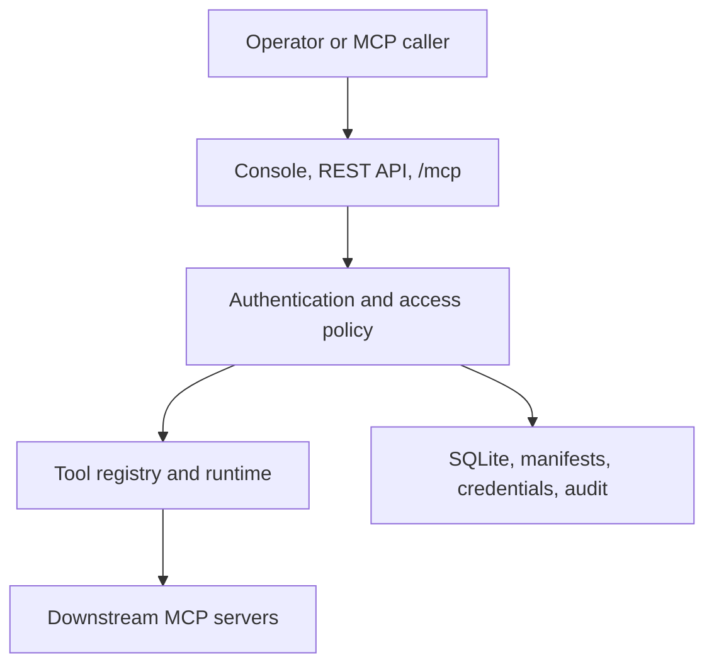

# Architecture

[简体中文](zh-CN/architecture.md) · [Documentation index](README.md)

Lingshu Gate is one deployable control plane with explicit internal boundaries. It exposes an authenticated MCP gateway and management API while keeping protocol transport, access policy, runtime state, persistence, and project execution separately testable.

## System view

The gateway does not make discovered tools callable by default. Discovery produces registry input; classification, publication, resource grants, and token scope determine effective access.

## Components

| Component | Responsibility | Security boundary |
|---|---|---|
| Web Console | Static management UI served by Gate | Uses the same authenticated API; no privileged side channel |
| Control API | Configuration, access, credentials, runtime, delivery, and diagnostics | Each route enforces its required role or permission |
| MCP gateway | Request validation, tool discovery, and invocation at `/mcp` | Applies authentication, protocol, classification, grant, and scope checks |
| Registry | Stable tool definitions and downstream routing | Definitions are untrusted until reviewed and published |
| Runtime | Stateless external HTTP requests and native managed stdio processes | Launch support depends on deployment mode |
| Persistence | SQLite records, manifests, encrypted credentials, operation state | Local filesystem ownership is part of the trust boundary |
| Project Delivery | Upload, preflight, plan, build, deploy, start, and refresh | Every remote write is confirmation- and idempotency-bound |
| Observability | Structured logs, events, probes, diagnostics, and invocation audit | Secret values and payloads are redacted or disabled by default |

## Request paths

### MCP invocation

1. The caller sends `server/discover` and subsequent stateless requests to `/mcp` with protocol version `2026-07-28` in the required per-request metadata.
2. Gate authenticates the request's Console credential or bearer token.
3. `tools/list` returns only definitions visible to the principal.
4. `tools/call` checks control permission, published read/write classification, resource grant, and token scope.
5. The registry invokes a first-party `gate_*` operation or routes the call to a downstream server.
6. Gate records the decision and a redacted invocation audit.

An unsupported protocol version fails negotiation. Gate does not silently select an older protocol mode.

### Control-plane write

1. The request is authenticated.
2. Route-level control permission is checked.
3. Request schema, expected digest, confirmation, and idempotency constraints are validated where applicable.
4. State is written atomically where the local store supports it.
5. A structured event records the result without secret values.

### Project delivery

Project bytes move through a bounded upload session. A committed source digest feeds preflight and an immutable build-plan fingerprint. Deployment binds the successful build, source digest, plan fingerprint, target configuration digest, and redacted credential-binding digest. Startup and tool refresh bind the deployed configuration and produce a tool-snapshot digest.

See [Project delivery](project-delivery.md) for the operation contract.

## Persistence layout

Gate uses three administrator-selected roots:

| Root | Contains | Backup requirement |
|---|---|---|
| Data | `gate.db`, encrypted credential stores and keys, uploads, builds, artifacts, and local operation state | Back up as one protected unit while Gate is stopped |
| Config | `mcp.d` YAML or JSON server manifests | Back up with data so runtime and audit state stay aligned |
| Workspace | Files explicitly exposed to trusted local downstream processes | Keep read-only where possible; back up according to project policy |

Temporary work belongs in the operating system temporary directory and must not become a source of persistent truth.

SQLite is a single-Core storage boundary. Multiple Gate processes must not concurrently share one database file.

## Deployment modes

| Mode | Downstream HTTP | Managed stdio | Project build execution | Intended use |
|---|:---:|:---:|:---:|---|
| Native binary or source | Yes | Yes, including explicit managed containers when a local engine is available | Yes | Trusted single-host operation and development |
| Docker Core | Yes | No | No | Isolated control plane and external HTTP gateway |

Managed stdio and project builds execute local code with the Gate process account. A native managed-container target uses the explicitly configured local container engine and is still an operator execution boundary. Native mode is therefore for trusted projects, not hostile multi-tenant execution.

Managed containers have one non-configurable isolation baseline: digest-pinned images, no network, read-only filesystems, dropped capabilities, no privilege escalation, bounded resources, and read-only bind sources revalidated inside the allowed root at execution.

## Invariants

- Authentication is enabled unless a local operator explicitly disables it.
- The default network bind is loopback.
- Secrets never belong in logs, tool output, manifests, archives, or audit payloads.
- A tool definition or annotation cannot grant itself access.
- A write retry reuses an idempotency key only when every bound input is unchanged.
- Digest drift stops an overwrite, deployment, startup, or classification update.
- A running process is not delivery acceptance until tool discovery and classification reconciliation complete.
- Failure handling reports recoverable state before any rollback, stop, delete, or force action.

## Extension rule

New downstream support uses the generic MCP transport and manifest model so the Gate core remains vendor-neutral.
