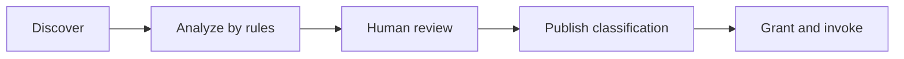

# MCP gateway and downstream servers

[简体中文](zh-CN/mcp-gateway.md) · [Documentation index](README.md)

Lingshu Gate exposes one authenticated Streamable HTTP MCP endpoint at `POST /mcp`. It aggregates reviewed first-party operations and tools discovered from configured downstream servers.

## Connection contract

- Endpoint: `http://127.0.0.1:8000/mcp` for the default local deployment.
- Protocol version: `2026-07-28`, fixed by the release.
- Authentication: an authenticated Console cookie or `Authorization: Bearer <api-token>`.
- Content negotiation: follow the Streamable HTTP requirements of the protocol.
- Request model: HTTP is stateless; send the required protocol and caller metadata on every request.

Start with `server/discover`, use a current protocol implementation, and derive tool names from `tools/list`. Do not construct downstream tool names from assumptions about server IDs. Unsupported protocol versions and malformed request metadata fail with a protocol error.

Each HTTP request mirrors routing data in headers and JSON-RPC parameters:

| Location | Contract |
|---|---|
| `MCP-Protocol-Version` header | `2026-07-28` |
| `Mcp-Method` header | Exact JSON-RPC method |
| `Mcp-Name` header | Exact encoded name for a tool call or other named operation |
| `params._meta.io.modelcontextprotocol/protocolVersion` | Same protocol version as the header |
| `params._meta.io.modelcontextprotocol/clientCapabilities` | Caller capability object, even when empty |
| `params._meta.io.modelcontextprotocol/clientInfo` | Caller name and version when available |

Gate rejects a header/parameter mismatch before dispatch. This keeps routing metadata independently verifiable at the HTTP boundary.

Remote deployments must use HTTPS. Gate should remain on a private interface behind the TLS reverse proxy.

## Discovery-to-access flow

Discovery is not authorization. A downstream tool becomes callable only when all applicable checks pass:

1. the caller is authenticated;
2. the caller has `tools.read` or `tools.invoke` as required;
3. the tool has a current, human-reviewed, published read/write classification;
4. the caller has the relevant server or tool resource grant;
5. an API token, when used, includes a sufficient scope;
6. required downstream credentials are configured for that caller.

New, changed, missing, and reappearing definitions return to review. Gate does not infer permission from a tool's name, description, schema, or annotations.

The first-party classification operations are:

- `gate_tool_classification_list`
- `gate_tool_classification_analyze`
- `gate_tool_classification_review`
- `gate_tool_classification_publish`

Analysis uses local rules and produces review input. Review and publication remain separate writes, and publication must bind the current fingerprint.

## Downstream Streamable HTTP

Use `launch.type=external` and `transport.type=streamable_http`. Gate sends stateless downstream requests with per-request metadata, applies request and startup timeouts, and routes discovery and calls through the registry.

There are two credential layers:

- system headers in `transport.headers`, usually expressed with `${credential:<id>}`, apply to Gate's downstream connection;
- declared `user_credentials` slots inject a value into the isolated HTTP request context only for the authenticated user making the call.

Gate does not write resolved values into manifests or return them in API responses. A missing required binding fails the call before it reaches the downstream endpoint.

## Downstream stdio

Use `launch.type=managed_process` and `transport.type=stdio` in a native deployment. Gate starts the configured executable directly, exchanges protocol messages over stdin/stdout, captures bounded diagnostic output, and tracks desired and observed state.

Stdio constraints:

- the command, arguments, and working directory must be reviewed local values;
- the working directory must remain inside the configured allowed root;
- the process inherits only the configured environment and Gate service-account privileges;
- secrets use credential references and are resolved only for process launch;
- per-user secret injection is unavailable because the process is shared;
- Docker Core rejects managed local process launch.

Do not place a shell command line in one string. Keep `command` and `args` separate so the execution boundary is explicit.

## Downstream managed container

Native mode can use `launch.type=managed_container` with stdio when a local container engine is explicitly available. Gate starts only a reviewed SHA-256 digest-pinned image, then uses its stdio transport.

This is a high-trust operator feature with a fixed execution profile: no network, read-only root, no Linux capabilities, no privilege escalation, bounded memory/CPU/PIDs, and protected temporary filesystems. Bind mounts use structured `mounts`, remain read-only, and are resolved inside the allowed root again at execution. Manifest environment values cannot steer Gate or the Docker CLI. Docker Core rejects this launch type and must not receive a container-engine socket.

## Configuration lifecycle

The Console and `/v1/mcp/configs` APIs support list, validate, create, update, apply, reload, and delete operations. Runtime endpoints under `/v1/mcp/servers` expose current status, details, lifecycle actions, and discovered tools.

Recommended sequence:

1. Save credentials without exposing their values in the manifest.
2. Validate the manifest.
3. Save with `auto_start=false`.
4. Review the configuration diff and resolved credential IDs.
5. Apply or start the server.
6. Inspect health and discovered definitions.
7. Analyze, review, and publish classifications.
8. Add the smallest resource grants.
9. Verify one read-only call before enabling write access.

Deleting or replacing a server ID affects grants, credential bindings, runtime state, and audits. Treat it as a controlled write and back up configuration and data first.

## First-party Gate tools

Gate registers only operations that belong to its own control and delivery boundaries:

| Tool family | Purpose |
|---|---|
| `gate_system_debug` | Bounded, read-only overview, server detail, logs, events, and diagnostics |
| `gate_file_upload_*` | User-bound, short-lived file upload and `fileRef` creation for calls that explicitly accept it |
| `gate_tool_classification_*` | List, rule analysis, human review, and publication of tool classifications |
| Project Delivery `gate_*` tools | Upload, build, deploy, start, status, and tool reconciliation |

The complete Delivery list is in [Project delivery](project-delivery.md). First-party tool access is subject to the same authentication, permission, scope, and audit checks as downstream tools.

## Invocation and files

REST callers can inspect definitions through `/v1/tools` and invoke an authorized tool through the documented invoke endpoint. MCP callers use `tools/list` and `tools/call`.

For tools that explicitly declare file-reference support, upload at most the bounded size through `gate_file_upload_begin`, `gate_file_upload_chunk`, and `gate_file_upload_commit`, then pass the returned short-lived `fileRef`. File references are bound to the uploading user and target context; Gate does not convert arbitrary paths from a caller into local filesystem access.

## Failure behavior

- Authentication and authorization failures do not reach downstream servers.
- Discovery failure preserves the last accepted registry snapshot where the operation supports it.
- A downstream timeout is not reported as a successful call.
- Protocol, schema, credential, and digest errors are structured and omit secret values.
- Runtime status distinguishes desired state from observed process or connection state.
- A process marked running is not sufficient evidence that tool discovery succeeded.

Use [Operations](operations.md) to correlate server status, logs, events, diagnostics, and invocation audits without enabling payload logging.
