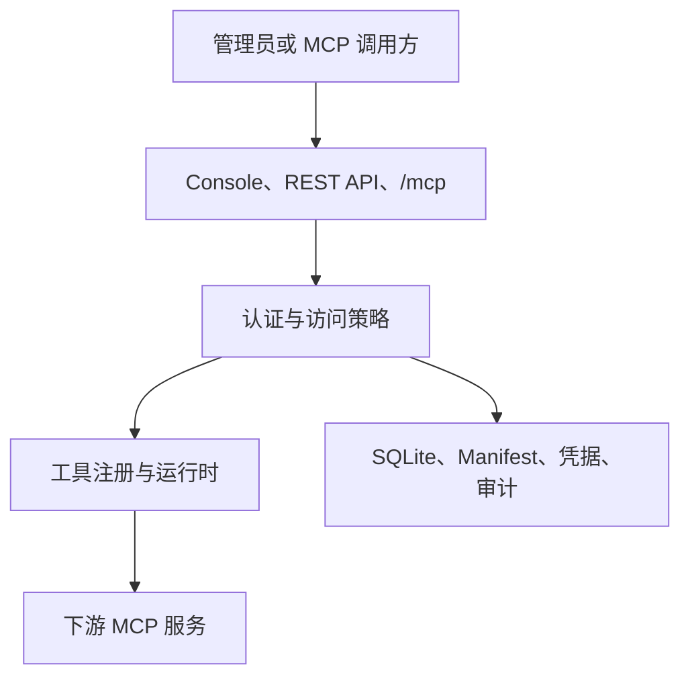

# 架构

[English](../architecture.md) · [文档索引](README.md)

Lingshu Gate 是一个内部边界明确的可部署控制平面。它对外提供认证 MCP 网关和管理 API，同时让协议传输、访问策略、运行状态、持久化和项目执行可以分别测试。

## 系统视图

网关不会让发现到的工具默认可调用。发现结果只是注册输入；最终访问权限由分类、发布、资源授权和 Token scope 共同决定。

## 组件

| 组件 | 职责 | 安全边界 |
|---|---|---|
| Web Console | 由 Gate 提供的静态管理界面 | 使用同一套认证 API，没有高权限旁路 |
| 控制 API | 配置、访问、凭据、运行时、交付和诊断 | 每个路由检查对应角色或权限 |
| MCP 网关 | `/mcp` 上的请求校验、工具发现和调用 | 检查认证、协议、分类、授权和 scope |
| Registry | 稳定工具定义和下游路由 | 定义在复核和发布前不可信 |
| Runtime | 无状态外部 HTTP 请求和原生受管 stdio 进程 | 启动能力取决于部署方式 |
| 持久化 | SQLite 记录、Manifest、加密凭据和操作状态 | 本地文件系统所有权属于信任边界 |
| 项目交付 | 上传、预检、计划、构建、部署、启动和刷新 | 每个远程写操作都绑定确认和幂等 |
| 可观测性 | 结构化日志、事件、探针、诊断和调用审计 | 默认脱敏 Secret 并关闭 payload 记录 |

## 请求路径

### MCP 调用

1. 调用方把 `server/discover` 和后续无状态请求发送到 `/mcp`，并在每个请求的必需元数据中携带协议版本 `2026-07-28`。
2. Gate 认证请求中的 Console 凭据或 Bearer Token。
3. `tools/list` 只返回该主体可见的定义。
4. `tools/call` 检查控制权限、已发布的读写分类、资源授权和 Token scope。
5. Registry 调用第一方 `gate_*` 操作，或把调用路由到下游服务。
6. Gate 记录决策和脱敏调用审计。

不支持的协议版本会使协商失败，Gate 不会静默选择更早的协议模式。

### 控制平面写操作

1. 请求完成认证。
2. 检查路由级控制权限。
3. 在适用时校验请求 Schema、预期摘要、确认和幂等约束。
4. 在本地存储支持的范围内原子写入状态。
5. 用不含 Secret 值的结构化事件记录结果。

### 项目交付

项目字节通过受限上传会话传输。提交后的源文件摘要进入预检，并生成不可变的构建计划指纹。部署绑定成功构建、源文件摘要、计划指纹、目标配置摘要和脱敏凭据绑定摘要。启动和工具刷新绑定已部署配置，并生成工具快照摘要。

操作契约见 [项目交付](project-delivery.md)。

## 持久化布局

Gate 使用三个由管理员指定的根目录：

| 根目录 | 内容 | 备份要求 |
|---|---|---|
| Data | `gate.db`、加密凭据存储及密钥、上传、构建、产物和本地操作状态 | Gate 停止后作为一个受保护整体备份 |
| Config | `mcp.d` 下的 YAML 或 JSON 服务 Manifest | 与 Data 一起备份，保持运行时和审计状态一致 |
| Workspace | 明确提供给可信本机下游进程的文件 | 尽量保持只读，并按项目策略备份 |

临时工作文件应位于操作系统临时目录，不能成为持久状态的事实来源。

SQLite 是单 Core 存储边界。多个 Gate 进程不能并发共享同一个数据库文件。

## 部署方式

| 方式 | 下游 HTTP | 受管 stdio | 项目构建执行 | 适用场景 |
|---|:---:|:---:|:---:|---|
| 原生二进制或源码 | 是 | 是；本机容器引擎可用时也可显式使用受管容器 | 是 | 可信单机运行和开发 |
| Docker Core | 是 | 否 | 否 | 隔离控制平面和外部 HTTP 网关 |

受管 stdio 和项目构建会以 Gate 进程账户执行本机代码。原生受管容器目标使用显式配置的本机容器引擎，仍属于管理员执行边界。因此原生模式只适用于可信项目，不能用于敌对多租户执行。

受管容器只有一套不可配置的隔离基线：固定 Digest 的镜像、无网络、只读文件系统、删除 Capability、禁止权限提升、限制资源，并在执行时再次确认只读 Bind Source 位于 Allowed Root 内。

## 不变量

- 认证保持开启，除非本机管理员显式关闭。
- 网络默认绑定回环地址。
- Secret 不得进入日志、工具输出、Manifest、归档或审计 payload。
- 工具定义或 annotation 不能给自身授予权限。
- 只有全部绑定输入不变时，写操作重试才能复用幂等键。
- 摘要漂移会停止覆盖、部署、启动或分类更新。
- 进程运行不等于交付验收；工具发现和分类对账也必须完成。
- 失败处理先报告可恢复状态，再执行任何回滚、停止、删除或强制操作。

## 扩展规则

新增下游支持使用通用 MCP 传输和 Manifest 模型，使 Gate 核心保持与具体厂商无关。
