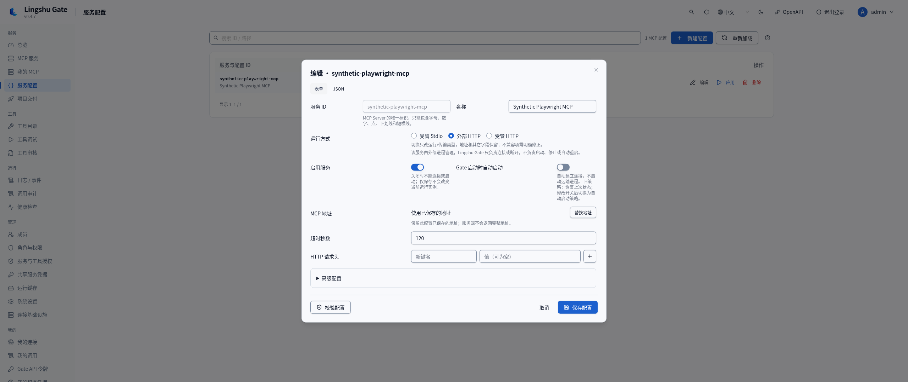
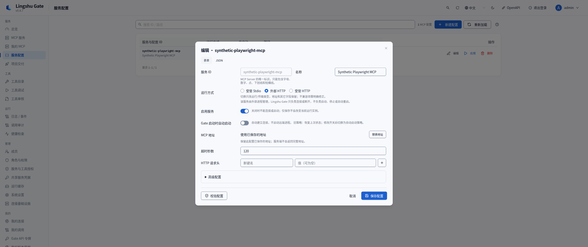
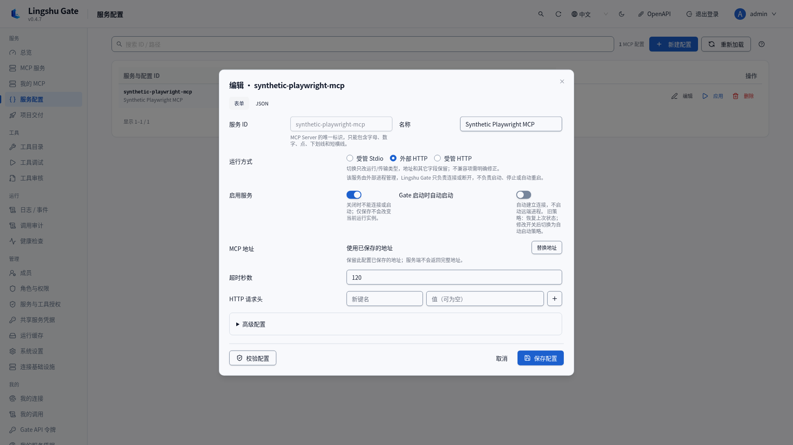
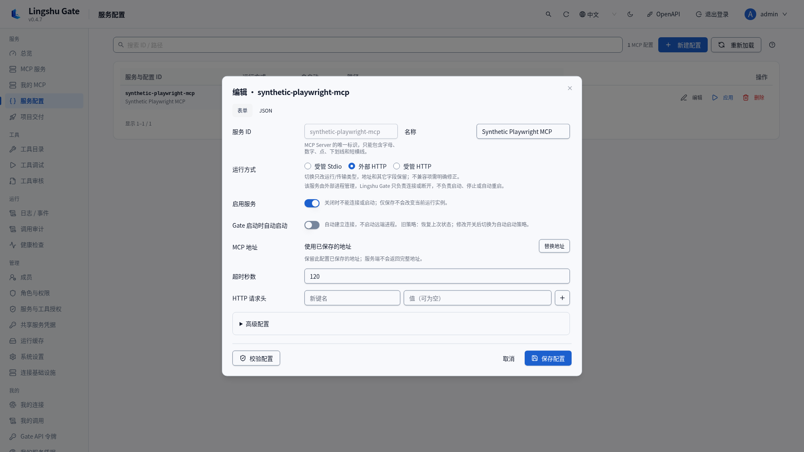
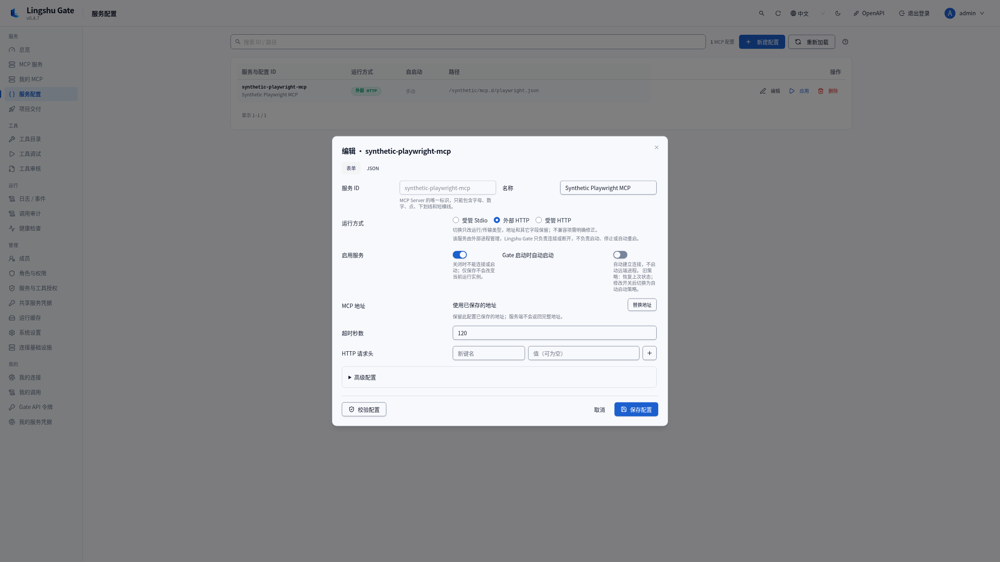
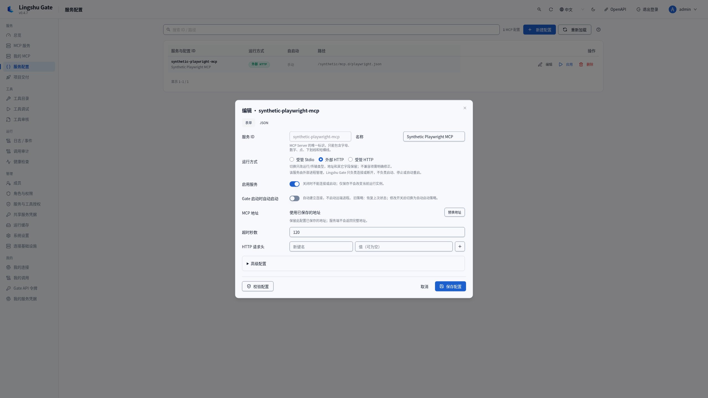
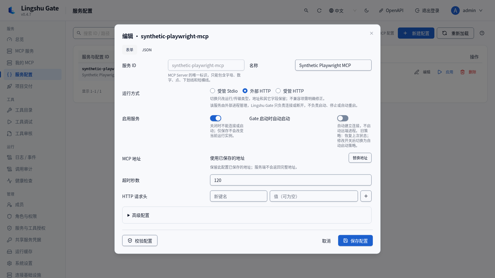
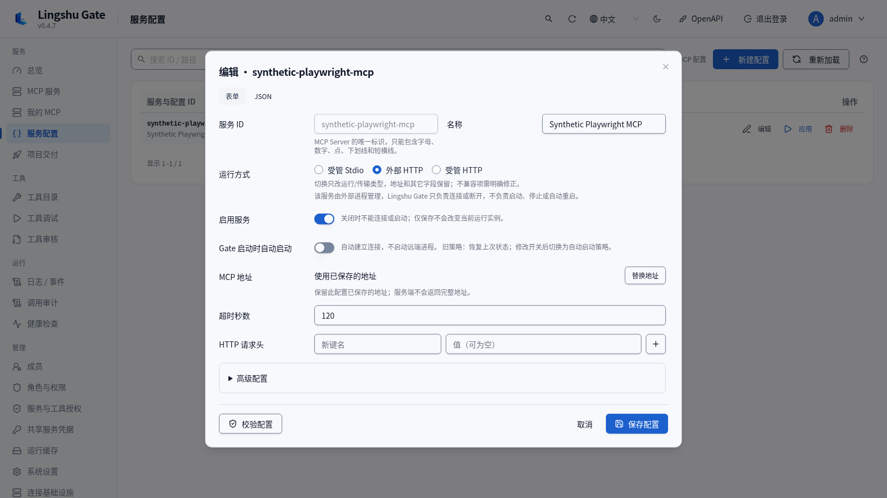

# 服务配置布局验证

## 独立代码审查后的契约修正

下方对照图片及 70e3b08 实现保留为历史证据。当前实现 `77b1a8d348764528742fefa53e78117631de381a` 修正了原开关右侧提示，复用既有 Field，将帮助文案放在**开关下方**；适用 UI 契约未改动或放宽。

ConfigsPage 启用既有确认框的焦点恢复选项。新建／编辑关闭、继续编辑都有直接浏览器回归；原编辑触发按钮被移除或禁用时，焦点返回可用的新建配置按钮。第三个消费者 DeliveryConfigEditor 经实际 BuildsPage 进入，在四档桌面和两种语言中验证草稿保留及单次草稿保存 PUT，start／overwrite 均保持 false。

最终检查通过：455 项前端测试、类型／UX 检查、Console／OAuth 构建及 49 项浏览器用例，未重试。[纯文字后续证据](../benchmarks/gate-service-modal-contract-followup-77b1a8d.json)记录源码 blob、负向对照及本地截图元数据。23 张新增 PNG 均留在原云环境，未加入 Git、上传或传递；原截图历史保持。新源码仍待增量代码复核和视觉验收。

此独立修复对齐既有的**服务配置 → 编辑**表单。四档中文桌面对照使用实际构建的 Console 和合成 API 数据。dot／父线程独立复核及真实远端部署验收仍为**待完成**。

| 来源 | 精确提交 |
| --- | --- |
| 基线 main | `45cec40c1e57d7290ab249e620b5a50fa939e115` |
| 实现 | `70e3b08c219b738dbee2551cb88407f0d758a634` |
| 分支 | `fix/gate-service-modal-alignment-20261010` |

基线的成对字段标签宽 **136px**，整行标签宽 **272px**。四档桌面中的首列控件均错开 **136px**。启动选项又将 272px 标签塞进半宽列，留给开关及说明的宽度只有 **111px**。根因是固定网格宽度冲突，未证实此前的百分比宽度假设。

表单现在每种语言共用一条固定标签轨道（中文 **160px**，英文 **272px**），容器不足时拆开成对字段。启用和自动启动分别占一行，开关对齐且说明可读。原有 860px 编辑框、标题、内边距及页脚保持，共用的 1200px 服务配置弹窗也保持框架。另对未修改基线运行了负向对照，确认放弃草稿后的焦点返回问题原已存在，再局部修复为返回仍在页面上的新建／编辑触发按钮。

## 实际桌面对照

每张图片均为 Chromium 关闭动画后的完整视口，处于相同的外部 HTTP 编辑状态，包含服务 ID、运行方式、启用／自动启动、地址、超时及请求头。名称、路径和响应均为合成数据，未重新发布用户的原始私有截图。

| 视口 | 修复前 | 修复后 | 首列控件左边界差 |
| --- | --- | --- | --- |
| 2560×1080 |  |  | 136px → 0px |
| 1920×1080 |  |  | 136px → 0px |
| 2560×1440 |  |  | 136px → 0px |
| 1600×900 |  |  | 136px → 0px |

实现者检查了这些对照：控件起点已对齐，开关说明有足够空间，标签保持单行，保存页脚可见。DOM 几何数据没有横向溢出或标签溢出。1600×900 英文布局将 ID／名称拆为独立行，保留较长的自动启动标签。

## 模式、错误与键盘

| 1600×900 实际截图 | 内容 |
| --- | --- |
| [受管 Stdio](../benchmarks/gate-service-modal-alignment-70e3b08/after-managed-stdio-zh-1600x900.png) | 命令／工作目录及对齐的启动控制。 |
| [受管 HTTP](../benchmarks/gate-service-modal-alignment-70e3b08/after-managed-http-zh-1600x900.png) | 新增地址字段，页脚仍可操作。 |
| [长错误、高级配置、地址焦点](../benchmarks/gate-service-modal-alignment-70e3b08/after-long-error-advanced-focused-zh-1600x900.png) | 替换后的长 URL、折行的合成校验错误、焦点边框及可操作页脚；内容区可滚动。 |
| [英文外部 HTTP](../benchmarks/gate-service-modal-alignment-70e3b08/after-external-en-1600x900.png) | 单行标签、可读的开关说明及可见保存操作。 |

实际浏览器通过了三种运行方式、替换地址、展开高级配置、校验汇总跳转字段焦点、空格切换启用、方向键选择运行方式、从取消 Tab 到保存、确认放弃草稿后返回编辑按钮焦点。既有测试覆盖保存／应用／启动、权限、地址遮罩和表单／JSON 无损编辑。

## 检查与边界

| 实际运行检查 | 结果 |
| --- | --- |
| 前端类型及 UX 源码检查 | 通过，退出码 0。 |
| 前端单元测试 | 75 文件、455 测试通过，退出码 0。 |
| Console 与 OAuth web 构建 | 通过，退出码 0。 |
| 实际 Playwright 用例 | 34 通过：7 个新增用例和 27 个既有配置用例，退出码 0；未重试。 |
| 基线截图 | 4 通过；基线捕获脚本跳过 2 个仅修复后运行的用例。 |
| 基线焦点负向对照 | 预期失败；未修改前端未返回编辑按钮焦点，最终前端通过。 |
| 空白与源码边界 | `git diff --check` 通过，无版本或权限变更。 |

既有配置用例还对四档桌面、英文／中文、浅色／深色执行了表单／JSON 自动检查（16 档组合）。它们覆盖第二个共用的 1200px 弹窗，与主要 860px 对照分别记录；并未逐张完成全部组合的人工视觉复核。

环境为原保存的 Linux 云执行器（Node 24.19.0、npm 11.9.0、Chromium 151.0.7922.173、Playwright 1.63.0、Vite 8.3.2）。隔离回环服务渲染实际构建的应用，API 配置和校验结果使用合成数据，未修改真实服务或远端配置。

[机器可读证据](../benchmarks/gate-service-modal-alignment-70e3b08/validation.json)绑定源码 blob、12 张截图、几何数据、命令结果及原始日志哈希。命令路径转为仓库相对路径，原始日志保存在私有目录。

此 UI 分支未合入、打标或发布。不可变的 v0.4.7 资产保持原源码。本次展示／焦点变更未重跑 backend／打包或真实 nx5／Podman。**独立设计复核及真实远端视觉验收仍待完成。**

[English](../service-config-layout-validation.md)
